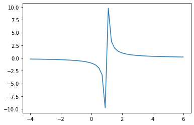
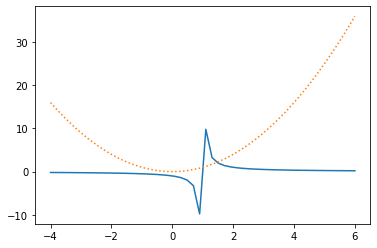
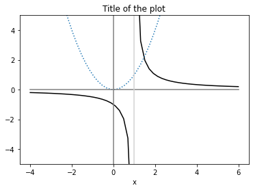

# Représentation graphique

La visualisation nécessite deux bibliothèques : NumPy pour la formation et la manipulation de listes de valeurs (des tableaux ou arrays dans le jargon NumPy) et Maplotlib pour la partie graphique proprement dite. La cellule de code intervient généralement assez haut dans le carnet Jupyter :

```Python
import numpy as np
import matplotlib.pyplot as plt
```

Nous allons illustrer les possibilités de visualisation via un problème.

## Problème

Soit à représenter graphiquement la fonction $f(x) := 1/(x - 1)$.

L'intervalle sur lequel représenter la fonction peut être connu à l'avance ou alors il peut être à la charge de l'utilisateur de trouver un intervalle représentatif ou intéressant.

**Choix de l'intervalle.** S'il faut choisir un intervalle, on peut procéder par tâtonnement ou se laisser guider par certaines valeurs remarquables. Dans l'exemple présenté ci-dessous, il est assez clair qu'il y a une singularité en $x = 1$ et il paraît par conséquent assez naturel de représenter la fonction sur un intervalle contenant la valeur $x = 1$ (tout en se méfiant des problèmes numériques que cela peut aussi engendrer).

Nous choisirons de représenter la fonction sur l'intervalle $[-4, +6]$.

## Obtention des valeurs

Même si cela n'est pas obligatoire, c'est une bonne idée de définir une fonction Python :

```Python
def f(x):
    return 1/(x - 1)
```

En effet, cela permet de coller de plus près à la notation mathématique et de faire appel ultérieurement à la fonction $f$ pour faire des vérifications.

La première étape consiste en la création d'une grille de valeurs à l'aide de la fonction `linspace()` :

```
x = np.linspace(-4, +6)
```

Cela affecte à la variable $x$ une liste de valeurs régulièrement espacées couvrant l'intervalle $[-4, +6]$. Par défaut, le pas entre deux valeurs consécutives est choisi de façon à ce que la liste soit constituée de 50 valeurs. Mais on peut densifier cette grille de valeurs en utilisant une valeur plus élevée pour l'argument optionnel `num` de la fonction `linspace()` :

```Python
x = np.linspace(-4, +6, num=128)
```

## Calcul des ordonnées

Pour chaque abscisse de la grille constituée grâce à linspace, on calcule la valeur de l'ordonnée correspondante sur la courbe avec

```Python
y = f(x)
```

Il faut bien comprendre que dans `y = f(x)` on s'appuie sur les fonctionnalités de NumPy qui calcule la valeur de la fonction $f$ pour toutes les valeurs contenues dans le vecteur (calcul terme à terme).

## Affichage

L'affichage se fait grâce à la fonction `plot()` de Matplotlib :

```Python
plt.plot(x, y)
```



Pour représenter plusieurs courbes représentatives simultanément, il suffit de cumuler les appels à plot dans la même cellule :

```Python
plt.plot(x, y)
plt.plot(x, x**2, linestyle='dotted')
```



L'option linestyle permet de modifier l'apparence de la courbe  l'option color permet de changer la couleur (cf. infra).

On peut ajouter un certain nombre de commandes dans la même cellule pour annoter le graphique.

```Python
plt.plot(x[x < 1], y[x < 1], color='black')
plt.plot(x[x > 1], y[x > 1], color='black')
plt.plot([-4, +6], [0, 0], color='gray') # X axis
plt.plot([0, 0], [-5, +5], color='gray') # Y axis
plt.plot([1, 1], [-5, +5], color='lightgray') # Asymptote
plt.xlabel('x')  # ylabel exists too
plt.ylim(-5, +5) # xlim exists too
plt.title('Title of the plot')
```



Dans les situations où cela est approprié, on peut aussi ajouter `plt.yscale('log')` pour obtenir une échelle logarithmique sur l'axe des ordonnées (`plt.xscale('log')` est possible aussi).

Pour obtenir une légende, on peut recourir à

```Python
x = np.linspace(-1, 1)
plt.plot(x, np.sin(x), label='sin')
plt.plot(x, np.exp(x), label='exp')
plt.legend()
```


## Points et nuages de points

```Python
x = np.linspace(-1, 1, num=10)
plt.scatter(x, np.sin(x), label='sin')
plt.plot(x, np.exp(x), label='exp')
plt.legend()
```

## Épilogue

La visualisation proposée n'est pas tout à fait satisfaisante, car on ne gère pas correctement la discontinuité en 𝑥=1 et cela se manifeste par un segment quasi vertical en plein milieu du graphique. Il faudrait donc travailler encore un peu pour arriver à un graphique de qualité. Cependant, le graphique avec ses imperfections vous donne déjà les éléments pour vous guider dans une résolution d'exercice.

<!-- Fonctions clefs : import, linspace, plot et les fonctions mathématiques de NumPy. -->

