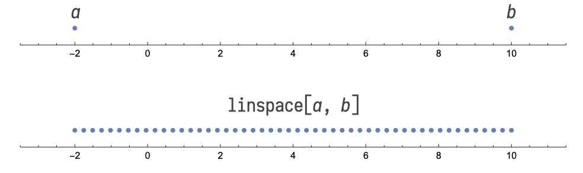

# Numpy

La bibliothèque NumPy est généralement importée dans Python à l'aide de l'instruction

```Python
import numpy as np
```

Lorsqu'on la charge ainsi, la bibliothèque NumPy vient avec son espace de fonctions propre. On parle d'**espace de nommage** (*namespace* en anglais). Par conséquent, on accède aux fonctions de NumPy à l'aide du préfixe `np.`, par exemple `np.sqrt()` pour la fonction racine carrée.

On peut parfois souhaiter déverser certaines fonctions dans l'espace de nommage principal, auquel cas on peut recourir à

```Python
from numpy import sqrt
```

## Génération de tableaux

NumPy permet de procéder à des calculs sur un grand nombre de valeurs de façon transparente grâce à une structure de données nommée « tableau NumPy » (*NumPy array*).

### Produire une grille de valeurs avec `linspace`

La fonction [linspace](fonction_np_linspace.html) permet de générer une grille de valeurs régulièrement espacées entre un point de départ \(a\) et un point d'arrivée \(b\). Le résultat est un tableau.



Plus d'informations sur cette fonction sur la page dédiée : [](fonction_np_linspace.html).

### Produire une liste d'entiers avec `arange`

`arange(a, b)`, où \(a\) et \(b\) sont des entiers, produit un tableau des entiers allant de \(a\) (inclus) à \(b\) (exclu) — la logique est la même que pour les tranches (cf. les [objet](objet.html) Python).

Plus d'informations sur cette fonction sur la page dédiée : [](fonction_np_arange.html).

### Initialiser un tableau de \(n\) entrées

Il est parfois nécessaire de préparer le terrain pour des calculs à venir. En supposant que la variable \(n\) contienne un nombre entier positif, il est possible de déclarer un tableau de \(n\) valeurs (sans valeur initiale particulière) :

```Python
np.empty(n)
```

Si l'on souhaite que le tableau soit initialisé avec des valeurs nulles :

```Python
np.zeros(n)
```

Si l'on souhaite que le tableau soit initialisé avec des valeurs égales à \(1\) :

```Python
np.ones(n)
```

### Créer un tableau à la main

Pour un tableau dont les éléments sont entrés manuellement, on utilise la fonction `array()`, laquelle prend une liste pour argument :

```Python
np.array([-3.71, +1.43, -2.49, +7.21, 9.05])
```

## Opérations sur les tableaux

Étant donné un tableau \(x\), il peut être utile de calculer certaines grandeurs comme le total ou la moyenne arithmétique :

* [`sum()`](fonction_np_sum) pour le total
* [`mean()`](fonction_np_mean) pour la moyenne arithmétique
* [`min()`](fonction_np_min_max#min) et [`max()`](fonction_np_min_max#max) pour les valeurs minimale et maximale
* [`std()`](fonction_np_var_std#std) et [`var()`](fonction_np_var_std#var) pour l'écart type et la variance

(Nous ne pouvons pas prétendre à l'exhaustivité ici.)

## Fonctions mathématiques

Les opérateurs traditionnels (`+`, `-`, `*`, `/` et `**`) fonctionnent parfaitement avec les tableaux NumPy : ces opérations sont simplement généralisées à partir de leur équivalent classique en procédant « terme à terme » ([array programming](https://en.wikipedia.org/wiki/Array_programming)). NumPy fournit en outre les fonctions mathématiques usuelles et celles-ci fonctionnent sur des tableaux NumPy, les listes Python, des entiers ou des nombres flottants.

| Fonction mathématique	| Fonction NumPy (préfixe `np.`) |
|-----------------------|--------------------------------|
| Racine carrée √       | `sqrt`                         |
| Arrondir              | `round`                        |
| \(\log\) (logarithme naturel) | `log`                  |
| \(\log_{10}\) (logarithme base 10) | `log10`           |
| \(\log_2\) (logarithme base 2) | `log2`                |
| \(\exp\)              | `exp`                          |
| \(\sin\)              | `sin`                          |
| \(\cos\)              | `cos`                          |
| \(\arcsin\) ou \(\sin^{-1}\) (arc sinus) | `arcsin`    |
| \(\arccos\) ou \(\cos^{-1}\) (arc cosinus) | `arccos`  |
| \(| x |\) (valeur absolue) | `abs`                     |
| \(\sinh\) (sinus hyperbolique) | `sinh`                |
| \(\cosh\) (cosh hyperbolique) | `cosh`                 |
| \(\sinh^{-1}\) (arc sinus hyperbolique) | `arcsinh`    |
| \(\cosh^{-1}\) (arc cosinus hyperbolique)	| `arccosh`  |

(Nous ne pouvons pas prétendre à l'exhaustivité ici.)

NB : Le succès rencontré par Python tient à ce que ces fonctions sont extrêmement bien construites et à la rapidité de leur exécution. Elles sont notamment dix fois plus rapides que le recours à une boucle [for](for).
